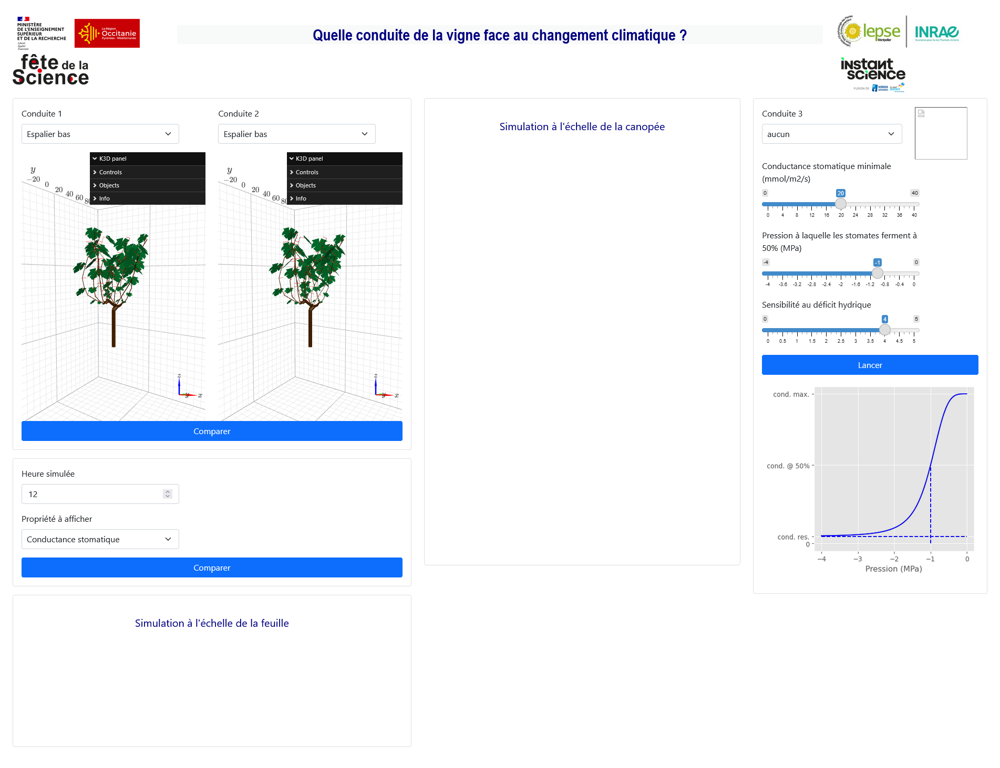

fete_de_la_science
==================
Data and models used in the demos for the "Fête de la Science" in Montpellier, 7-17 oct. 2022
This project includes an Interactive User Interface to HydroShoot model (Albasha et al., 2019, https://doi.org/10.1093/insilicoplants/diz007)

# Installation

### Clone the Shiny project :

    git@github.com:RamiALBASHA/fete_de_la_science.git

### Create and set the appropriate `conda` environment:

    conda create -n <MyEnv> -c openalea3 -c conda-forge openalea.hydroshoot
    conda activate <MyEnv>
    conda install -c conda-forge shiny
    pip install shinywidgets

**Note:** I had to run the last command twice in order to make it install `shinywidgets`.

### Run shiny:

Go into the root directory of `app.py` (~/fete_de_la_science/models/) and run shiny:

    shiny run --reload app.py

You must have the following information plotted into the terminal:

    INFO:     Will watch for changes in these directories: ['C:\\Users\\albashar\\Documents\\dvp\\fete_de_la_science\\models']
    INFO:     Uvicorn running on http://127.0.0.1:8000 (Press CTRL+C to quit)
    INFO:     Started reloader process [21560] using StatReload
    INFO:     Started server process [17920]
    INFO:     Waiting for application startup.
    INFO:     Application startup complete.

Click on the URL address (e.g. `http://127.0.0.1:8000` in this example), you should now have the following
interface running :

## You're done!

For example:

- Change the type of training systems ('Conduite 1' and 'Conduite 2') and compare performance ('Comparer').
- Run HydroShoot with different stomatal conductance parameters ('Lancer', do not forget to select a training suystem '
  Conduite 3') 
